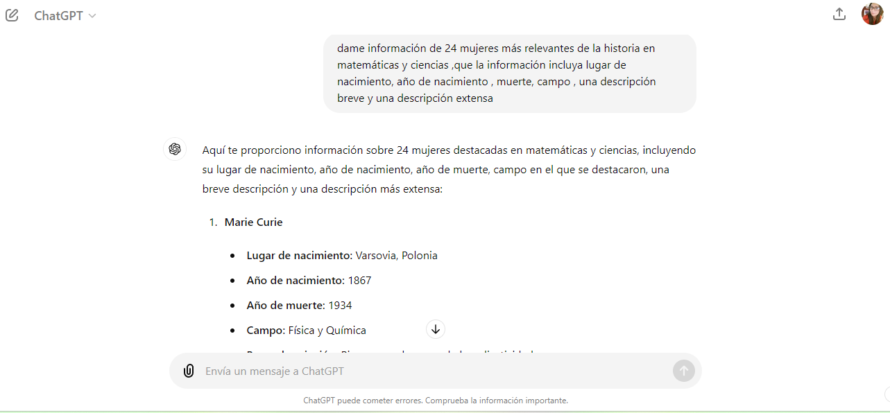
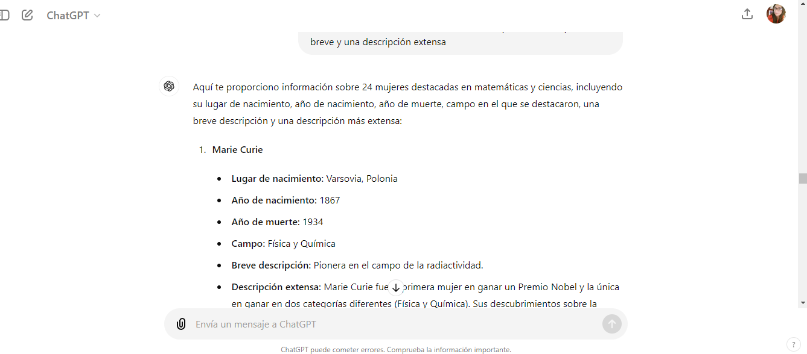
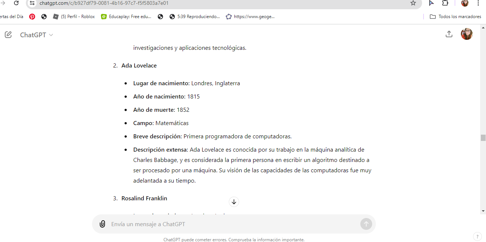

# Dataverse

## Índice

* [1. Resumen del proyecto](#1-resumen-del-proyecto)
* [2. Consideraciones generales](#2-consideraciones-generales)
* [3. Funcionalidades](#3-funcionalidades)

## 1. Resumen del proyecto

En este proyecto construímos una página web para visualizar un conjunto (set) de datos, que generamos con [prompting], en este caso usamos Chat GPT. Esta página web fue creada en base a lo que el usuario necesita.
Esta página web permite visualizar la data, filtrarla, ordenarla y calcular algunas estadísticas.

## 2. Consideraciones generales

* Este proyecto fue realizado en duplas.(Gaby y Pame)
* Lo primero que hicimos fue elegir un tema "Mujeres descatables en distintas áreas de la ciencia" y hacer  la historias de usuarios, que detallamos a continuación:
 
 * Historia de Usuarios:
1) Como usuario, quiero aprender sobre mujeres destacables en el área de ciencias, para conocer sus contribuciones y logros.

* Criterios de Aceptación:

La plataforma debe mostrar información detallada sobre cada mujer, incluyendo su nombre, campo de especialización y logros principales.
La información debe estar organizada y ser fácil de navegar.

2) Como usuario, quiero poder filtrar las mujeres por su área de especialización, para encontrar información específica sobre un campo de interés.

Criterios de Aceptación:

La plataforma debe incluir un sistema de filtrado que permita seleccionar áreas como computación, química, física, videojuegos y astronomía.

Los resultados deben actualizarse dinámicamente según el filtro seleccionado.

3) Como usuario, quiero poder ordenar la información de manera ascendente o descendente, para facilitar la comparación y análisis de datos.

Criterios de Aceptación:

La plataforma debe incluir opciones para ordenar la información alfabéticamente o por año de nacimiento.

El sistema de ordenación debe ser intuitivo y fácil de usar.

4) Como usuario, quiero ver imágenes representativas de las mujeres destacadas, para tener una experiencia visual enriquecedora.

Criterios de Aceptación:

Cada perfil debe incluir una imagen de la mujer destacada.
Las imágenes deben ser de alta calidad y relevantes.

* Definición de Terminado (Definition of Done):

Para considerar que nuestro proyecto esta terminado, debe cumplir con los siguientes criterios:

* Cumplimiento de Criterios de Aceptación:

Todos los criterios de aceptación definidos en las historias de usuario ya están  cumplidos.

La funcionalidad fue probada y validada para asegurar que cumple con lo especificado.

* Calidad del Código:

El código está libre de errores y advertencias.

El proyecto cumple con buenas prácticas de codificación y los estándares de estilo del proyecto.

El código está documentado adecuadamente.

* Pruebas:

Se realizaron las pruebas unitarias y de integración con resultados positivos.

Se realizaron pruebas de usuario para asegurar la funcionalidad y la usabilidad.

* Revisión de Código:

El código fue revisado por amboso miembros del equipo (Gaby o Pame) para asegurar la calidad y la corrección.

Se resolvieron todos los comentarios y sugerencias de la revisión.

* Documentación:

La funcionalidad está documentada en la documentación del proyecto.

Se actualizaron los cambios y las nuevas características en el archivo README del repositorio.

* Después nos dedicamos a la generación de los datos ,para el cuál usamos el ChatGPT , que también adjuntamos algunas capturas de pantallas.y para crear algunas imágenes fue con el generador de imágenes de Bing. El tema que elegimos fue mujeres destacables en el área de ciencias, ya sea de computación,química, física, videojuegos, astronomía etc.Donde la data fue incorporada en formato Jason.

* El proyecto se encuentra en GitHub y la interfaz está desplegada en GitHub Pages.

## 4. Funcionalidades

Logramos crear una página web que permite **visualizar la data,
filtrarla, ordenarla y calcular estadísticas**.

Aqui detallaremos las funcionalidades: 

* La aplicación permite a la usuaria ver los items de la data en una visualización en tipo tarjetas.

* La aplicación calcula y visualiza una estadística de la data.

* La aplicación permite a la usuaria filtrar la data. Para ésto usamos 
  un elemento [`<select>`].

* La aplicación permite a la usuaria ordenar la data.
  - Tiene un control `<select>` para ordenar.

* Las funcionalidades de ordenar opera sobre la data filtrada.
  
* La aplicación perimite a la usuaria reiniciar la aplicación, limpiando
  filtros y ordenamiento, con un `<button>'.

* Las operaciones de filtrar, ordenar, limpiar, etc. no recargan la página, 
  si no que agregan el contenido en una manera dinámica via javascript.

* La aplicación es responsiva, es decir, puede visualizarse sin problemas
  desde distintos tamaños de pantallas: móviles, tablets y desktops.

* Este proyecto no solo celebra las contribuciones de mujeres notables en la ciencia, sino que también sirve como un recurso educativo para inspirar y motivar a futuras generaciones. Gaby y Pame, trabajando en duplas, logramos crear una plataforma que es informativa, fácil de usar y visualmente atractiva.

  Despliegue del proyecto https://gabyh7922.github.io/DEV015-dataverse/src/
